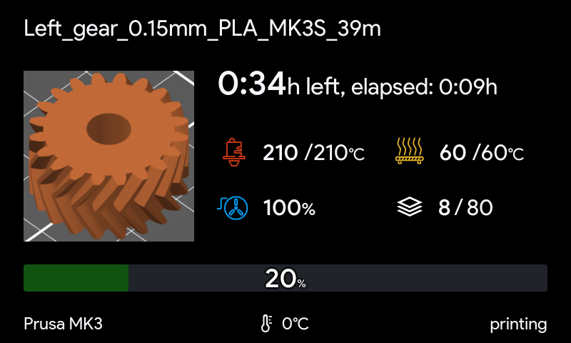
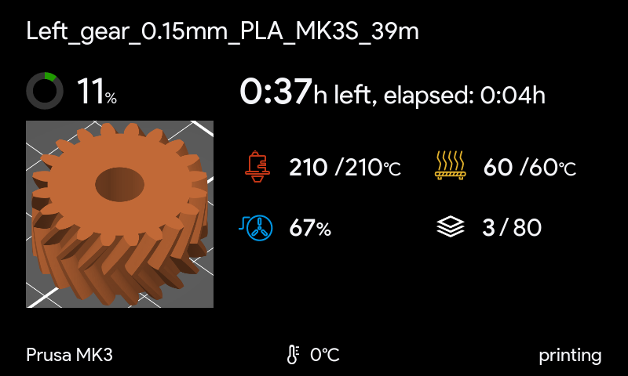
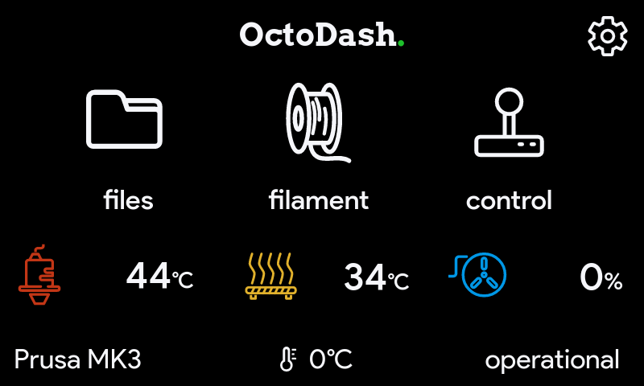
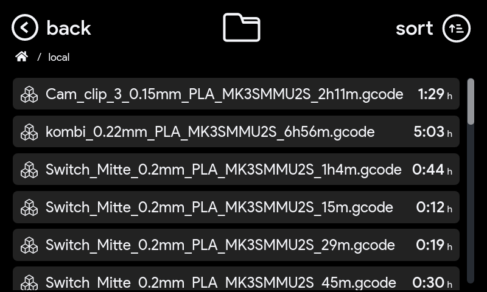
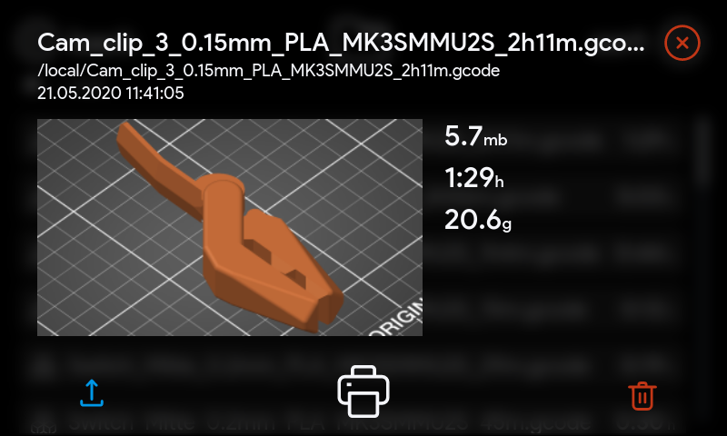

# NOX theme V0.2.2

I suggest setting the thumbnail resolution in PrusaSlicer a little bit higher if you want a sharper image:

```
thumbnails = 16x16,330x186
```

You also need to activate this setting in OctoDash:

**Settings > OctoDash > Preview by default while printing**

If you want to use the round progress bar:

**Settings > OctoDash > Always use circular progress bar**

### Screenshots:

1a. Printing Screen (progress bar):

   


1b. Printing Screen (round progress bar):

   


2. Main Screen:

   

3. File List:

   

4. File Details:

   

5. File loaded:

   
