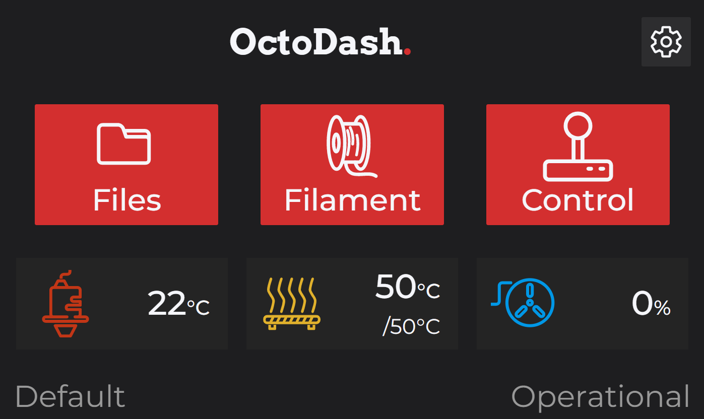
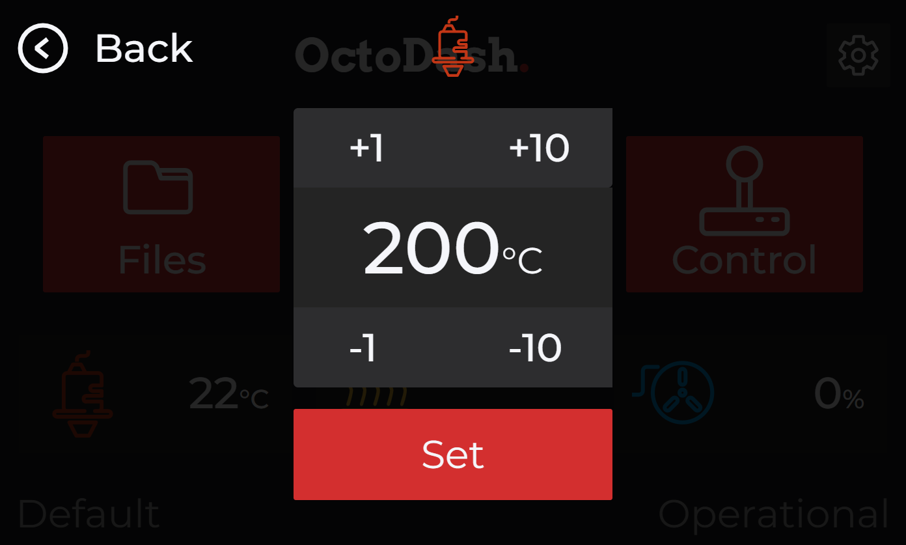
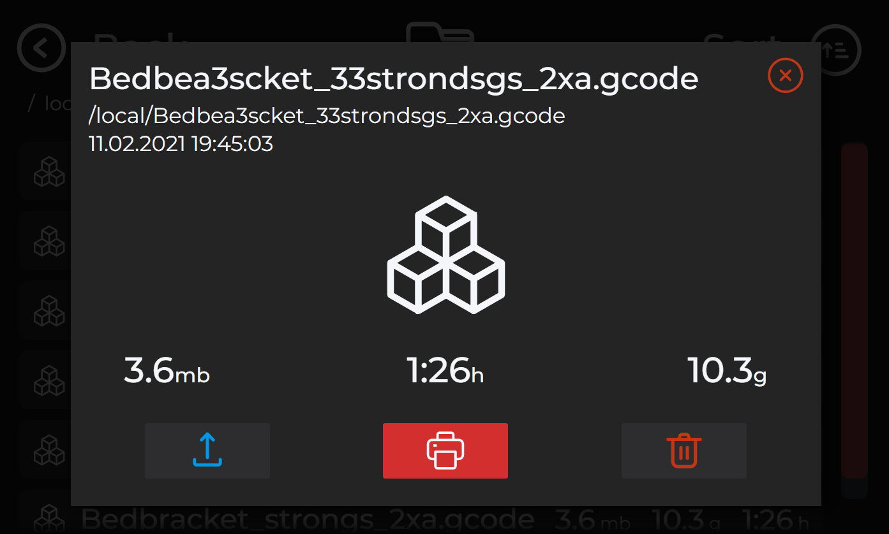
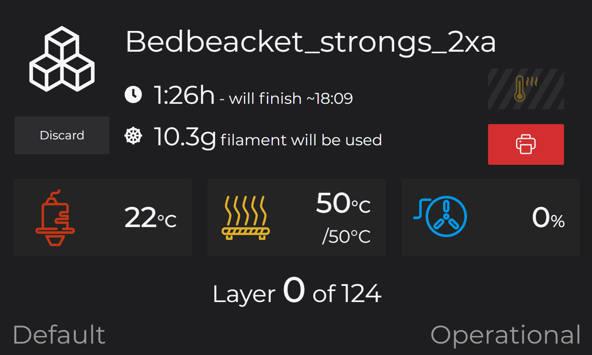
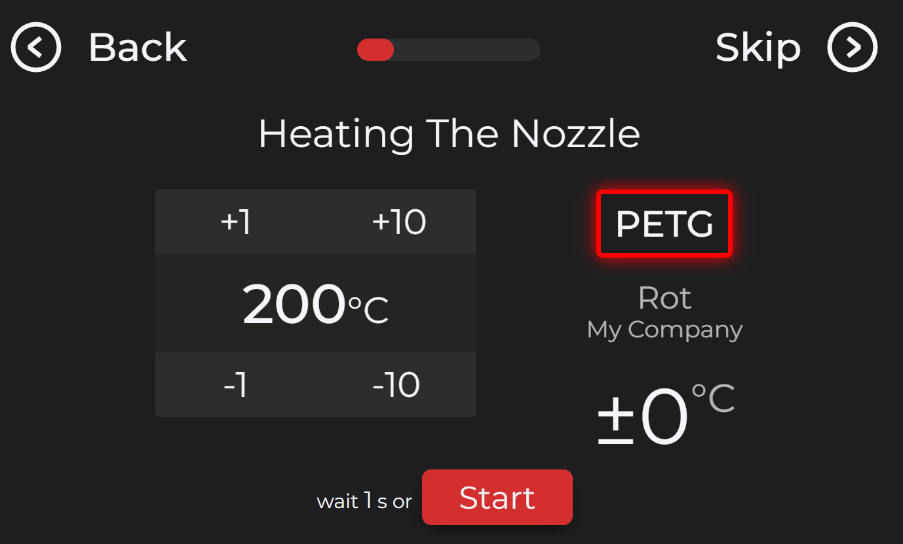
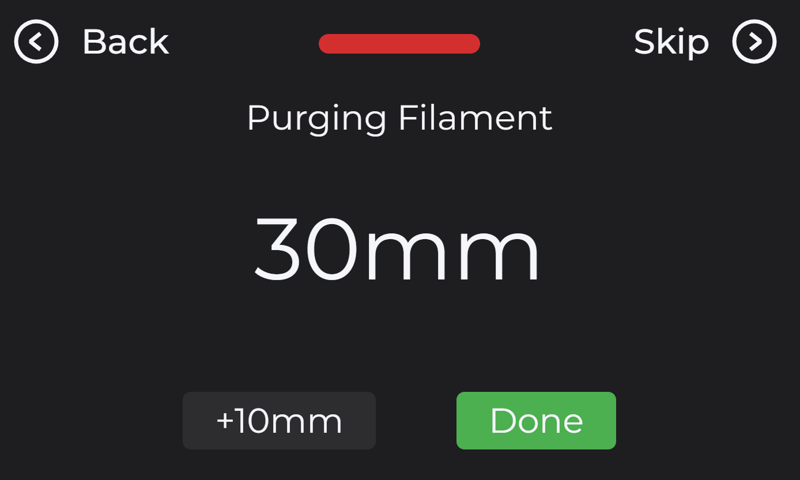
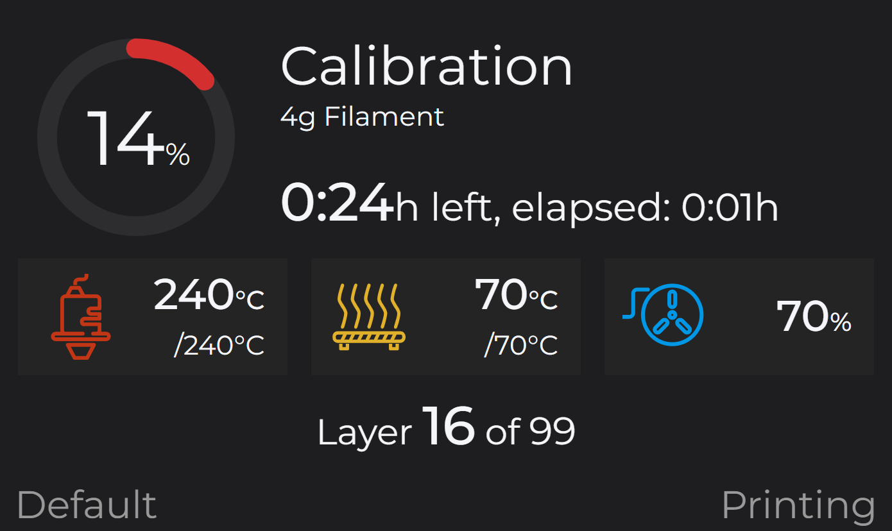
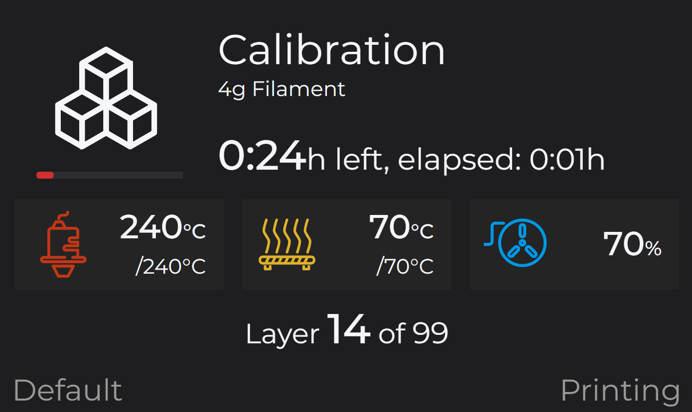
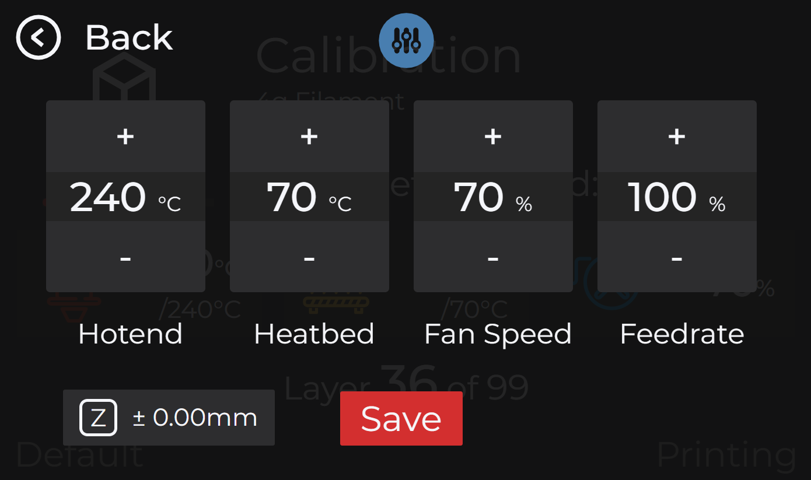

# Dark Nights

A dark theme with customizeable accent color which matches my octoprint theme.

## Customize

To customize the accent color edit the hex-codes at the beginning of the `custom-styles.css`.

```css
:root {
    /* If a other accent color is more to your personal liking, change it here. ;) */
    --accent: #d32f2f;
    --accent-transparent: #d32f2f24;
    ...
}
```

Make sure to change also the transparent accent color.

## Screenshots

### Dashboard





### Files






### Filament change





### Printing






