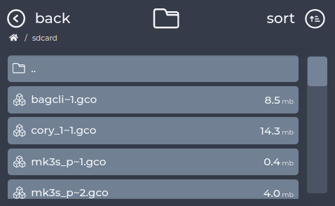
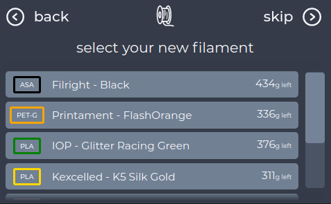
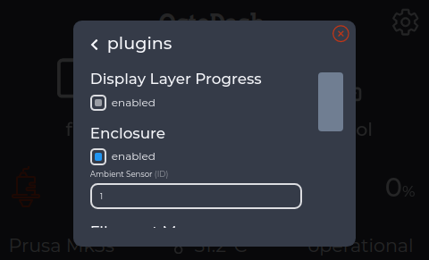

# BigFingers theme v0.3

This variation on the standard theme increases the width of the scroll bars to make them easier to touch on small displays.
No special requirements exist for this theme, however it is intended for small low resolution displays.

To install copy the custom-styles.css file into the octodash config folder:
```
~/.config/octodash/custom-styles.css
```
###### Theme by theGarbz.

### Screenshots:

1. File List:

   

2. Filament List:

   

3. Settings:

   


### Version History:

__v0.3:__
* Extra text removed from settings menu which ran off the screen.

__v0.2:__
* Hitbox of settings button increased.

__v0.1:__
* Initial Issue
* Larger vertical scrollbar width.