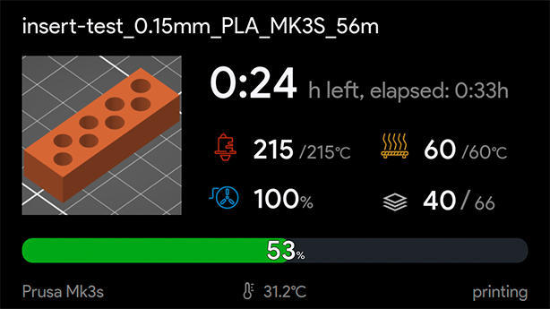
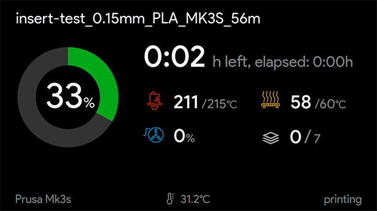
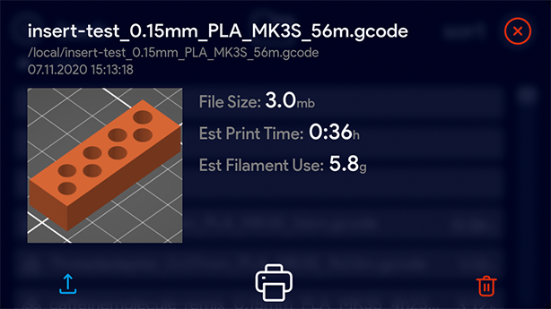
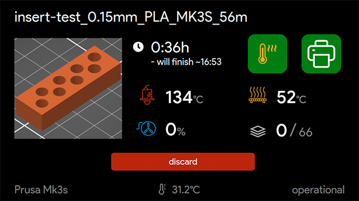
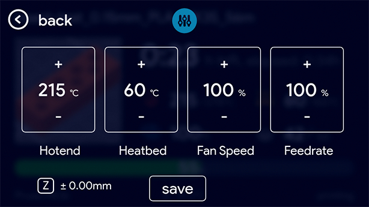
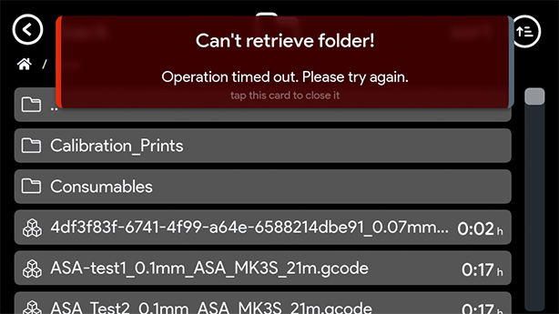
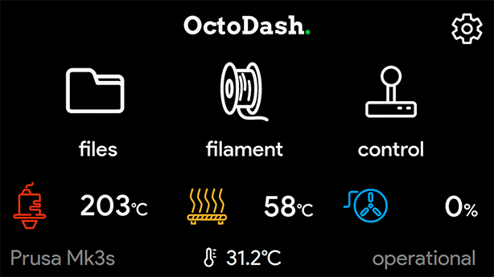
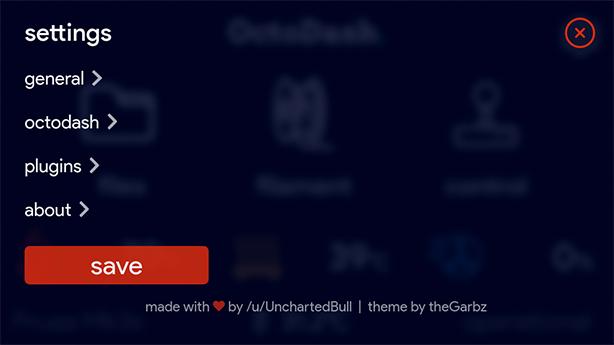

# Focus theme v0.4

This theme is based on the classy [NOX theme](../../NOX/) by NoxHirsch and has been modified to Focus on highlighting the most important information for a user. The goal was to create a theme that could easily be read from a distance. Some of the features are listed below:
* High contrast display of relevant information (e.g. print time, temperature)
* Low contrast display of all other info (e.g. units, time elapsed)
* Large horizontal and vertical progress bars readable from a distance.
* Large print time remaining indicators
* Pre-printing screen highlighting buttons.
* Full screen menus and adjustments with coloured backgrounds for context.
* Red highlighting of error messages

To install copy the custom-styles.css file into the octodash config folder:
```
~/.config/octodash/custom-styles.css
```

Please note: This theme like the theme it was based on makes use of more CSS effects than the default theme and does not perform as smoothly on under powered hardware such as older Raspberry Pis. If you have a problem with Octodash performance please try using the default theme before reporting any issues. This theme performs well on a Raspbery Pi4 with a 7" LCD.

###### Theme by theGarbz.

## Screenshots:

1. Printing with the Horizontal Progressbar:

   

2. Printing with Circular Progressbar:

   

4. File Selection:

   

5. Pre-print screen:

   

6. Adjustments mid print:

   

7. Errors:

   

8. Main Screen:

   

9. Settings:

   

### Version History:

__v0.4:__
* Fix for Layer display code - Reenables the icon in place of text.
* Fixed settings items running off the edge of the screen.
* Fxied settings scroll bars so they no longer run off the bottom of the screen.

__v0.3:__
* Temporary change in Layer display code to suit new Layer-Progress Component.

__v0.2:__
* Fixed bug which prevented the filament weight from being shown in the filament selector.

__v0.1:__
* Initial Issue
