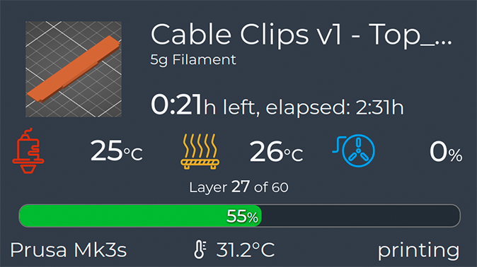
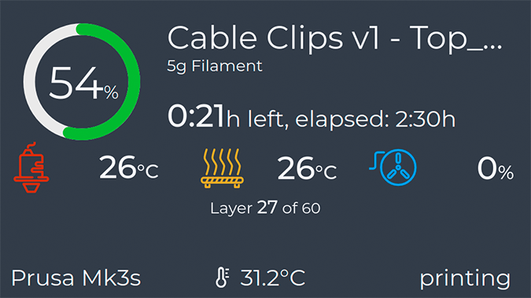

# Glanceable theme v0.2

This variation on the standard theme includes a nearly full width horizontal progress bar during printing. This makes it far easier to see the progress of a print when glancing at the screen from a distance, hence the name "Glanceable theme".

To install copy the custom-styles.css file into the octodash config folder:

```
~/.config/octodash/custom-styles.css
```

###### Theme by theGarbz.

## Screenshots:

1. Printing with the Horizontal Progressbar:

   

2. Printing with Circular Progressbar:

   

### Version History:

**v0.2:**

- Theme updated to suit new layer progress layout in Octodash 2.2.0

**v0.1:**

- Initial Issue
