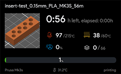
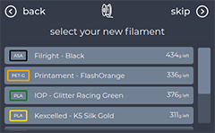
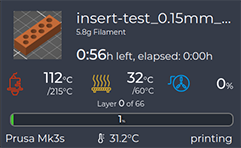

# A collection of themes by Garbz

### [Focus](Focus/) ###
This theme focuses on important information for the user. A variation on the NOX theme, it reduces the contrast of non-important elements and incorporates large very easy to see progress bars giving the user quick access to the most important of information. 

### [Big-Fingers](BigFingers/) ###
A variation on the default theme with wider vertical scrollbars. This is optimised for smaller screens and makes navigating files and filaments easier.

### [Glanceable](Glanceable/) ###
A variation on the default theme which introduces the option of a horizontal progress bar during printing. This alternate view allows for easier view of print progress from a distance while retaining the look and feel of the rest of the default OctoDash theme.

